# Argus — System Architecture

> **Argus** is a proactive memory assistant that monitors WhatsApp conversations, extracts events and actions using **Llama 3.3 70B via DigitalOcean Gradient**, stores them in **SQLite (FTS5)**, and surfaces contextual reminders through a Chrome extension. It includes a 3-tier AI fallback system, FTS5 keyword search, automated daily backups, and a **DigitalOcean Gradient ADK Agent** (Python/LangGraph) for agentic AI chat.

## Architecture Diagram

```mermaid
flowchart TB
    %% ============ EXTERNAL SOURCES ============
    WA["WhatsApp User Messages"]
    CHROME["Chrome Browser Tabs"]
    GRADIENT_API["DigitalOcean Gradient\nllama3.3-70b-instruct\n(OpenAI-compat endpoint)"]
    ADK_AGENT["DO Gradient ADK Agent\n(Python / LangGraph)\nsearch_events · get_event tools"]

    %% ============ EVOLUTION API LAYER ============
    subgraph EVOL_LAYER ["Evolution API Layer"]
        direction TB
        EVOL["Evolution API :8080"]
        PG[("PostgreSQL DB")]
        EVOL <--> PG
    end

    %% ============ ARGUS SERVER ============
    subgraph ARGUS_SERVER ["Argus Server :3000"]
        direction TB

        subgraph INGESTION ["Message Ingestion Pipeline"]
            direction TB
            WH["Webhook Receiver\n/api/webhook/whatsapp"]
            PREFILTER["shouldSkipMessage()\nTrivial Pre-filter\nempty · emoji · 'ok' · 'lol'"]
            DETECT["detectAction()\nCancel / Done / Snooze / Ignore"]
            EXTRACT["extractEvents()\nLlama Event Extraction"]
            REPAIR["repairJSON(preferredKey)\nProse+Markdown → JSON\nscans all blocks, prefers by key"]
            CONF_GATE["Confidence Gate ≥ 0.65"]
            DEDUP["findDuplicateEvent()\n48h Title Similarity Check"]
            CONFLICT["checkEventConflicts()\n60min Window"]
            SAVE["insertEvent() + insertTrigger()"]
        end

        subgraph AI_TIER_SYS ["AI Fallback Tier System"]
            direction TB
            TIER_MGR["ai-tier.ts\nTier Manager"]
            T1["Tier 1\nLlama 3.3 70B (full)"]
            T2["Tier 2\nRegex Heuristics"]
            T3["Tier 3\nLRU Cache + Safe Defaults"]
            TIER_MGR --> T1
            TIER_MGR -->|"cooldown active"| T2
            TIER_MGR -->|"10+ failures"| T3
        end

        subgraph AI_ENGINE ["Gradient AI Engine (gradient.ts)"]
            direction TB
            LLAMA_CALL["callLlama()\nwithFallback() wrapper"]
            CHAT_CTX["chatWithContext()\nDirect Llama Chat"]
            GEN_POPUP["generatePopupBlueprint()\nFull Popup Spec via AI\nicon · title · buttons · styles"]
            VALIDATE["validateRelevance()\nURL ↔ Event Matching"]
        end

        subgraph SCHEDULER_SYS ["Scheduler System"]
            direction TB
            TIME_TRIG["checkTimeTriggers\n60s interval"]
            DUE_REM["checkDueReminders\n30s interval"]
            SNOOZE_CHK["checkSnoozedEvents\n30s interval"]
            RETRY_Q["processRetryQueue\n30s interval"]
            BACKUP_JOB["runDailyBackup\n24h interval"]
        end

        subgraph DATA_LAYER ["Data Layer (db.ts)"]
            direction TB
            SQLITE[("SQLite\nbetter-sqlite3\nsync API")]
            FTS5["FTS5 Virtual Table\nevents_fts\ntitle · keywords · description"]
            DB_OPS["CRUD Operations"]
            DB_OPS <--> SQLITE
            FTS5 <--> SQLITE
        end

        subgraph BACKUP_SYS ["Backup System"]
            direction TB
            BACKUP["backup.ts\nexportAllData / importData / prune"]
            DEAD_LETTER["data/dead-letter.jsonl\nFailed write recovery"]
            FAILED_REM["data/failed-reminders.jsonl\nUndelivered notifications"]
        end

        subgraph ERROR_SYS ["Error Handling"]
            direction TB
            SAFE_ASYNC["safeAsync()\nCatch + fallback"]
            WITH_RETRY["withRetry()\n1 retry, 45s budget"]
            FETCH_TO["fetchWithTimeout()\n30s AbortController"]
        end

        subgraph API_ENDPOINTS ["REST API"]
            direction TB
            EP_HEALTH["/api/health"]
            EP_AI_STATUS["/api/ai-status"]
            EP_STATS["/api/stats"]
            EP_EVENTS["/api/events/*"]
            EP_CHAT["/api/chat"]
            EP_CONTEXT["/api/context-check"]
            EP_BACKUP["/api/backup/*"]
            EP_WA["/api/whatsapp/*"]
            EP_INTERNAL["/api/internal/*\n(x-internal-secret gated)"]
        end

        WS_SERVER["WebSocket Server /ws"]
    end

    %% ============ CHROME EXTENSION ============
    subgraph EXTENSION ["Chrome Extension — Manifest V3"]
        direction TB

        subgraph BG_WORKER ["Service Worker"]
            BG["background.js"]
            WS_CLIENT["WebSocket Client"]
            BG <--> WS_CLIENT
        end

        subgraph CONTENT ["Content Script"]
            CS["content.js"]
            POPUP_MGR["Popup Manager\n(8 popup types)"]
            CS --> POPUP_MGR
        end

        subgraph SIDEPANEL ["AI Chat Sidebar"]
            SP_JS["sidepanel.html/js"]
        end

        subgraph EXT_POPUP ["Extension Popup"]
            POP_JS["popup.html/js\n+ Export Backup button"]
        end
    end

    %% ============ CONNECTIONS ============
    WA -->|"messages"| EVOL
    EVOL -->|"webhook POST"| WH

    WH --> PREFILTER
    PREFILTER -->|"non-trivial"| DETECT
    DETECT -->|"AI call via withFallback()"| TIER_MGR
    EXTRACT -->|"AI call via withFallback()"| TIER_MGR
    TIER_MGR --> LLAMA_CALL
    LLAMA_CALL -->|"Tier 1"| GRADIENT_API
    LLAMA_CALL -->|"prose/JSON repair"| REPAIR
    LLAMA_CALL -.->|"failure reported"| TIER_MGR

    DETECT -->|"no action"| EXTRACT
    EXTRACT --> CONF_GATE
    CONF_GATE -->|"≥ 0.65 → dedup"| DEDUP
    DEDUP -->|"unique → save"| SAVE
    SAVE --> CONFLICT
    CONFLICT -->|"overlap detected"| GEN_POPUP
    SAVE --> DB_OPS
    SAVE -->|"new event"| GEN_POPUP

    GEN_POPUP -->|"AI call"| LLAMA_CALL
    GEN_POPUP -->|"popup blueprint"| WS_SERVER

    CHAT_CTX -->|"AI call"| LLAMA_CALL
    VALIDATE -->|"AI call"| LLAMA_CALL

    EP_CHAT -->|"try ADK first"| ADK_AGENT
    ADK_AGENT -->|"search_events tool"| EP_INTERNAL
    ADK_AGENT -->|"get_event tool"| EP_INTERNAL
    EP_INTERNAL --> FTS5
    EP_INTERNAL --> DB_OPS
    EP_CHAT -->|"fallback / direct"| CHAT_CTX

    TIME_TRIG --> DB_OPS
    DUE_REM --> DB_OPS
    SNOOZE_CHK --> DB_OPS
    RETRY_Q --> WS_SERVER
    BACKUP_JOB --> BACKUP

    SAFE_ASYNC --> DEAD_LETTER
    RETRY_Q --> FAILED_REM

    BACKUP <--> SQLITE
    DB_OPS <--> SQLITE

    SCHEDULER_SYS -->|"broadcast"| WS_SERVER
    WS_CLIENT <-->|"WebSocket :3000/ws"| WS_SERVER
    WS_CLIENT -->|"popup data"| CS

    EP_CHAT --> CHAT_CTX
    EP_CONTEXT --> VALIDATE
    EP_CONTEXT --> DB_OPS
    EP_CONTEXT --> FTS5
    EP_EVENTS --> DB_OPS
    EP_STATS --> DB_OPS
    EP_BACKUP --> BACKUP
    EP_AI_STATUS --> TIER_MGR

    SP_JS -->|"POST /api/chat"| EP_CHAT
    POP_JS -->|"GET /api/events"| EP_EVENTS
    POP_JS -->|"GET /api/stats"| EP_STATS
    POP_JS -->|"GET /api/backup/export"| EP_BACKUP
    CS -->|"POST /api/events/:id/action"| EP_EVENTS

    CHROME -->|"URL changes"| BG
    BG -->|"POST /api/context-check"| EP_CONTEXT
    EP_CONTEXT -->|"matching events"| BG
    BG -->|"context popup"| CS
```



---

## Component Breakdown

### 1. Evolution API Layer

| Component | Port | Purpose |
|-----------|------|---------|
| Evolution API | `:8080` | WhatsApp Web bridge (Baileys) — receives/sends messages |
| PostgreSQL | `:5432` | Stores Evolution API sessions, contacts, state |

### 2. Argus Server (`src/`)

| File | Purpose |
|------|---------|
| `server.ts` | Express + WebSocket server, all REST endpoints, startup bootstrap |
| `ingestion.ts` | Message processing pipeline: pre-filter → detect action → extract events → dedup → save |
| `gradient.ts` | All Llama AI calls via `callLlama()` with `withFallback()`: `extractEvents`, `detectAction`, `chatWithContext`, `generatePopupBlueprint`, `validateRelevance`. Includes `repairJSON(preferredKey)` for prose/markdown-wrapped responses |
| `db.ts` | All SQLite operations: CRUD, FTS5 search (`ftsSearchEvents`), stats, `exportAllData`, `importData`, `getPushSubscriptions` |
| `ai-tier.ts` | AI fallback tier manager: tracks failures, escalating cooldowns, background health pings every 60s |
| `fallback-heuristics.ts` | Tier 2 pure-regex replacements for all 5 LLM functions |
| `response-cache.ts` | Tier 3 LRU response cache (configurable TTL and max size) |
| `backup.ts` | Export / import / prune backup logic using `exportAllData` / `importData` from `db.ts` |
| `scheduler.ts` | Interval loops: time triggers (60s), reminders + retry queue (30s), snooze (30s), daily backup (24h) |
| `matcher.ts` | URL pattern matching and context extraction for browser trigger checks |
| `errors.ts` | `fetchWithTimeout`, `withRetry`, `safeAsync`, `logDeadLetter`, `logFailedReminder`, `LLMApiError`, `TimeoutError` |
| `quicksave.ts` | QuickSave CEP v9.1 — token compression for LLM prompts |
| `evolution-db.ts` | Direct PostgreSQL read access for Evolution API message history |
| `types.ts` | Zod schemas, TypeScript types, `parseConfig()` |

### 3. SQLite Tables

| Table | Key Fields | Purpose |
|-------|-----------|---------|
| `events` | `title`, `keywords`, `confidence`, `status`, `event_time`, `context_url`, `sender_name` | All extracted events/tasks/reminders |
| `messages` | `content`, `chat_id`, `sender`, `timestamp` | Raw WhatsApp messages |
| `triggers` | `trigger_type`, `trigger_value`, `is_fired`, `event_id` | Time and URL-based notification triggers |
| `contacts` | `id`, `name`, `message_count` | Contact list with activity counters |
| `context_dismissals` | `event_id`, `url_pattern`, `dismissed_until` | Per-URL 30-minute dismissal suppression |
| `push_subscriptions` | endpoint, keys | Browser push notification subscriptions |
| `events_fts` | FTS5 virtual table | Full-text search over title, keywords, description |

### 4. AI Fallback Tier System

| Tier | Activation | Behavior |
|------|------------|----------|
| **1** — Llama 3.3 70B | Normal operation | Full Llama AI extraction and analysis via Gradient |
| **2** — Heuristics | 1+ failures (cooldown active) | Regex/pattern replacements for all 5 AI functions |
| **3** — Cache/Default | 10+ consecutive failures | LRU response cache; safe defaults if cache miss |

Cooldown schedule: 1 failure → 30s, 3 consecutive → 5min, 10 consecutive → 15min.
Recovery to Tier 1 is immediate on any successful Llama call.
A background health ping runs every 60s during cooldown to detect recovery.

### 5. JSON Repair (`repairJSON`)

Llama 3.3 70B ignores `response_format: json_object` and often returns prose + markdown-wrapped JSON. `repairJSON(raw, preferredKey)` in `gradient.ts` uses a 4-step extraction:

1. Direct `JSON.parse(raw)`
2. Extract content from ` ```json ``` ` markdown fences
3. `extractAllJsonObjects()` — depth-tracked brace scan finds **all** valid `{ }` blocks; returns the first one containing `preferredKey` (e.g. `"events"`, `"isAction"`, `"response"`, `"relevant"`)
4. Brace-closing repair on truncated JSON

Each call site passes its expected schema key so the correct block is always selected even when Llama embeds examples or prose with other JSON in the same response.

### 6. Chrome Extension (`extension/`)

| File | Purpose |
|------|---------|
| `manifest.json` | Manifest V3 — permissions: sidePanel, activeTab, tabs, storage, notifications |
| `background.js` | Service worker — WebSocket client, tab URL monitoring, API calls |
| `content.js` | Injected into all pages — 8 popup overlay types, DOM form watcher |
| `sidepanel.html/js` | AI Chat sidebar — context-aware conversation, markdown rendering |
| `popup.html/js` | Extension popup — event cards, stats, Export Backup button |

### 7. DigitalOcean Gradient ADK Agent (`argus-agent/`)

A Python/LangGraph agent deployed on DigitalOcean Gradient. When `/api/chat` is called, Argus POSTs to the ADK agent URL first. The agent has two tools that call back into Argus via the internal API:

| Tool | Calls | Purpose |
|------|-------|---------|
| `search_events(query)` | `POST /api/internal/search` | FTS5 keyword search over events |
| `get_event(id)` | `GET /api/internal/events/:id` | Fetch a single event by ID |

Both internal endpoints require the `x-internal-secret` header. If the ADK agent fails or is unreachable, `/api/chat` falls back to `chatWithContext()` (direct Llama call with events embedded in the prompt).

**ADK Agent Data Flow:**
```
POST /api/chat
  → POST ADK_AGENT_URL (with user query)

  loop (LangGraph tool-call loop):
    → LLM decides which tool to call
    → search_events / get_event → POST /api/internal/* (x-internal-secret)
    ← tool result injected back into LangGraph context

  ← final response returned to Argus
  → Argus returns ChatResponse to extension

  (if ADK fails at any point)
  → fallback to chatWithContext() via withFallback()
```

### 8. Data Flow

```
WhatsApp Message
    → Evolution API (Baileys)
    → Webhook POST /api/webhook/whatsapp
    → shouldSkipMessage()    — trivial pre-filter (empty, emoji, "ok", "lol")
    → detectAction()         — NLP action recognition (via withFallback → Tier 1/2/3)
    → extractEvents()        — event extraction (via withFallback → Tier 1/2/3)
    → repairJSON()           — fix prose/markdown-wrapped Llama response
    → Confidence Gate ≥ 0.65 — reject low-confidence extractions
    → findDuplicateEvent()   — skip if same title seen in last 48h
    → insertEvent()          — stored in SQLite with FTS5 index
    → insertTrigger()        — time triggers (24h/1h/15m) + URL/keyword triggers
    → generatePopupBlueprint() — LLM-generated popup spec (icon, title, body, buttons)
    → WebSocket broadcast    → Chrome Extension
    → Dynamic popup overlay  — on active browser tab
```

```
Browser URL Change
    → background.js detects navigation
    → POST /api/context-check { url, title, keywords }
    → ftsSearchEvents()      — FTS5 BM25 keyword search
    → validateRelevance()    — LLM confirms match (Tier 1/2/3)
    → matching events returned
    → generatePopupBlueprint() — context-specific popup spec
    → context_reminder popup shown
```

```
AI Chat (sidebar)
    → POST /api/chat { query, history }
    → try ADK Agent (Python/LangGraph at Gradient)
        → tool calls: search_events / get_event → /api/internal/*
    → fallback: chatWithContext() with Llama + SQLite events in prompt
    ← ChatResponse { response, relevantEventIds }
```

### 9. Event Status Lifecycle

```
discovered → scheduled → reminded → completed
    ↓            ↓
  snoozed     snoozed
    ↓            ↓
  ignored     expired
```

| Status | Meaning |
|--------|---------|
| `discovered` | New event from WhatsApp — awaiting user action |
| `scheduled` | User approved — will receive time and context reminders |
| `snoozed` | Deferred — will reappear after snooze duration |
| `ignored` | User dismissed — hidden but not deleted |
| `reminded` | 1-hour-before reminder was delivered |
| `completed` | User marked as done |
| `expired` | Event time passed without action |
| `pending` | Fallback/legacy status |

### 10. Event Types

| Type | Example |
|------|---------|
| `meeting` | "Team standup tomorrow at 10am" |
| `deadline` | "Project deadline Friday 5pm" |
| `reminder` | "Don't forget to call grandma" |
| `travel` | "Trip to Manali next month" |
| `task` | "Buy groceries, pick up laundry" |
| `subscription` | "Cancel Spotify subscription" |
| `recommendation` | "Try biryani at Meghana Foods" |
| `other` | Catch-all for unclassified events |

### 11. Popup Types (8)

| Type | Trigger |
|------|---------|
| `event_discovery` | New event detected from WhatsApp |
| `event_reminder` | Time-based (24h, 1h, 15min before event) |
| `context_reminder` | URL matches event's `context_url` or `location` |
| `conflict_warning` | Overlapping events within 60-minute window |
| `insight_card` | Suggestion or recommendation surfaced |
| `snooze_reminder` | Snoozed event becomes due again |
| `update_confirm` | Incoming message suggests modifying an existing event |
| `form_mismatch` | DOM form field contradicts WhatsApp memory |

All popup specs are generated by `generatePopupBlueprint()` (Llama AI). The body text always starts with `"[SenderName] mentioned: ..."` when `sender_name` is known.

### 12. Scheduler Retry

Failed WebSocket deliveries are placed in an in-memory retry queue with exponential backoff:

| Attempt | Delay |
|---------|-------|
| 1st retry | 1 minute |
| 2nd retry | 5 minutes |
| 3rd retry | 15 minutes |

After 3 failed attempts the notification is permanently logged to `data/failed-reminders.jsonl`.
The queue is drained every 30s alongside the due-reminders check.

### 13. Error Handling

| Utility | Behaviour |
|---------|-----------|
| `fetchWithTimeout(url, opts, 30s)` | AbortController deadline on every `fetch()` call |
| `withRetry(fn, opts)` | 1 retry with exponential backoff; 30s first attempt, 15s retry (≤45s total) |
| `safeAsync(fn, fallback, ctx)` | Catch-and-fallback; dead-letters the payload on failure |
| `logDeadLetter(op, data, err)` | Appends to `data/dead-letter.jsonl`; auto-rotates at 10 MB |

Retryable errors: `TimeoutError`, `LLMApiError` (5xx / 429), network errors (`ECONNREFUSED`, `ENOTFOUND`, `fetch failed`, `socket hang up`, `ETIMEDOUT`).
Non-retryable: 4xx client errors (except 429).

### 14. Backup System

| Operation | Detail |
|-----------|--------|
| Daily export | Runs 60s after startup, then every 24h; saves to `data/backups/argus-backup-YYYY-MM-DD.json` |
| Retention | Oldest files pruned to keep last `BACKUP_RETENTION_DAYS` (default 7) |
| Scope | All SQLite tables; data exported via `exportAllData()` |
| Import modes | `merge` (upsert) or `replace` (truncate then bulk-insert) |
| Source tag | `"source": "argus-sqlite"` in backup JSON header |
| Manual trigger | Extension popup Export Backup button → `GET /api/backup/export` |

### 15. API Endpoints

| Endpoint | Method | Purpose |
|----------|--------|---------|
| `/api/health` | GET | Health check (`aiTier`, `aiTierMode` included) |
| `/api/ai-status` | GET | Current tier, consecutive failures, cache stats, cooldown info |
| `/api/stats` | GET | Event and message statistics |
| `/api/events` | GET | List events (filter by `?status=`) |
| `/api/events/:id` | GET / PATCH / DELETE | Read, update, or delete event |
| `/api/events/:id/set-reminder` | POST | Schedule reminder triggers |
| `/api/events/:id/snooze` | POST | Snooze for X minutes |
| `/api/events/:id/ignore` | POST | Ignore event |
| `/api/events/:id/complete` | POST | Mark done |
| `/api/events/:id/dismiss` | POST | Dismiss notification |
| `/api/events/:id/acknowledge` | POST | Acknowledge reminder |
| `/api/events/:id/confirm-update` | POST | Confirm pending AI-suggested update |
| `/api/events/:id/context-url` | POST | Set context URL trigger |
| `/api/events/day/:timestamp` | GET | Events for a specific day |
| `/api/events/status/:status` | GET | Events filtered by status |
| `/api/backup/export` | GET | Download full JSON snapshot |
| `/api/backup/list` | GET | List local backup files with counts |
| `/api/backup/import` | POST | Import from JSON body |
| `/api/backup/restore/:filename` | POST | Restore from saved backup file |
| `/api/whatsapp/messages` | GET | Messages from Evolution API |
| `/api/whatsapp/search` | GET | Search messages (`?q=`) |
| `/api/whatsapp/contacts` | GET | Contact list |
| `/api/whatsapp/chats` | GET | Chat list |
| `/api/whatsapp/instances` | GET | Evolution API instance status |
| `/api/whatsapp/stats` | GET | WhatsApp statistics |
| `/api/chat` | POST | AI Chat — ADK Agent (LangGraph) or direct Llama fallback |
| `/api/context-check` | POST | Check URL against events (FTS5 + LLM validation) |
| `/api/form-check` | POST | Check DOM form field against memory |
| `/api/extract-context` | POST | Extract context from URL |
| `/api/internal/search` | POST | FTS5 event search for ADK Agent (`x-internal-secret` required) |
| `/api/internal/events/:id` | GET | Fetch event by ID for ADK Agent (`x-internal-secret` required) |
| `/api/webhook/whatsapp` | POST | Evolution API webhook receiver |
| `/ws` | WebSocket | Real-time push to Chrome extension |

### 16. Tech Stack

| Layer | Technology |
|-------|------------|
| Runtime | Node.js 22 (Alpine) |
| Server | Express.js + ws (WebSocket) |
| AI | Llama 3.3 70B (`llama3.3-70b-instruct`) via DigitalOcean Gradient Serverless — OpenAI-compatible endpoint |
| AI Client | `openai` npm package with custom `baseURL: https://inference.do-ai.run/v1` |
| ADK Agent | Python 3.12, `gradient-adk` v0.2.11, LangGraph — deployed on DigitalOcean Gradient |
| Database | SQLite (`better-sqlite3`, synchronous API) with FTS5 virtual tables |
| Search | SQLite FTS5 BM25 keyword search + LLM validation |
| WhatsApp | Evolution API v2.x (Baileys) |
| Extension | Chrome Manifest V3 (service worker + content script) |
| Type System | TypeScript + Zod validation |
| Dev Tools | tsx (watch mode), Vitest (testing) |
| Containerization | Docker Compose (4 containers) |

---

## 17. DigitalOcean Features Used

### Gradient Serverless Inference

**What it is:** A serverless LLM inference API that exposes popular open-source models (including Llama 3.3 70B) through an OpenAI-compatible REST endpoint. No GPU provisioning or model hosting required.

**Endpoint:** `https://inference.do-ai.run/v1`
**Auth header:** `Authorization: Bearer <DO_GRADIENT_MODEL_KEY>`
**Integration point:** `src/gradient.ts` — `initGradient()` constructs an `openai` SDK client with a custom `baseURL` pointing at the Gradient endpoint.

**Functions that call Gradient Serverless** (all via `callLlama()` → `withFallback()`):

| Function | Trigger | Prompt schema |
|----------|---------|---------------|
| `extractEvents()` | Every incoming WhatsApp message | Returns `{ events: [...] }` |
| `detectAction()` | Every incoming WhatsApp message (before extract) | Returns `{ isAction, action, confidence, ... }` |
| `generatePopupBlueprint()` | New event saved, scheduler fires, URL trigger | Returns `{ icon, title, subtitle, body, buttons, ... }` |
| `validateRelevance()` | Context check (`/api/context-check`) | Returns `{ relevant: [ids], confidence }` |
| `chatWithContext()` | `/api/chat` fallback when ADK agent fails | Returns `{ response, relevantEventIds }` |

**Llama-specific quirk handled:** Llama 3.3 70B ignores `response_format: { type: 'json_object' }` and wraps JSON in markdown fences or prose. Each call site appends `"IMPORTANT: Return ONLY valid JSON..."` to the user message, and `repairJSON(raw, preferredKey)` post-processes the response — scanning all `{ }` blocks with `extractAllJsonObjects()` and selecting the one whose top-level key matches the expected schema.

**Fallback chain** when Gradient is unavailable:
```
callLlama() throws
  → reportFailure() increments consecutiveFailures
  → ai-tier.ts enters cooldown (30s → 5min → 15min)
  → withFallback() routes to Tier 2 (regex heuristics)
  → at 10+ failures, routes to Tier 3 (LRU cache / safe defaults)
  → background health ping every 60s tries a minimal "ping" completion
  → first success → reportSuccess() → back to Tier 1
```

---

### Gradient ADK (Agent Development Kit)

**What it is:** A Python SDK + CLI (`gradient-adk`) for building and deploying LLM agents on DigitalOcean infrastructure. Agents are defined as LangGraph state machines and deployed with a single CLI command.

**CLI workflow used:**
```bash
pip install gradient-adk==0.2.11
gradient agent init --agent-workspace-name argus-workspace   # creates .gradient/agent.yml
gradient agent deploy                                          # pushes to DO, returns run URL
```

**Deployed agent URL:** `https://agents.do-ai.run/v1/<agent-id>/production/run`
**Auth:** `DIGITALOCEAN_API_TOKEN` (dop_v1_...) for deploy; `GRADIENT_MODEL_ACCESS_KEY` for the agent's own Llama calls at runtime.

**Agent implementation — `argus-agent/main.py`:**

The agent is a LangGraph graph with two tools registered against `gradient-adk`'s tool registry. On each invocation it receives the user's chat query and enters a tool-call loop:

```
ADK Agent invoked with { query, history }
  │
  ├─ search_events(query: str)
  │    → POST http://<ARGUS_BACKEND_URL>/api/internal/search
  │    → headers: { x-internal-secret: <INTERNAL_API_SECRET> }
  │    → body: { query }
  │    ← list of matching events (FTS5 results)
  │
  ├─ get_event(id: int)
  │    → GET http://<ARGUS_BACKEND_URL>/api/internal/events/{id}
  │    → headers: { x-internal-secret: <INTERNAL_API_SECRET> }
  │    ← single event object
  │
  └─ synthesises final answer from tool results
```

**Why tool-calling beats embedding:** A direct `chatWithContext()` call embeds a static snapshot of the top-N events into the Llama prompt. The ADK agent can refine its search iteratively — search broadly, pick relevant IDs, fetch full details — producing more accurate answers for complex queries like "what did Rahul say about Goa last month?".

**Internal API security:** Both `/api/internal/search` and `/api/internal/events/:id` are gated by `requireInternalSecret` middleware in `server.ts`. Requests without a matching `x-internal-secret` header get `401 Unauthorized`. The secret is a random hex string shared between `.env` (Argus) and `argus-agent/.env`.

---

### Credential Map

| Variable | DO Product | Where set | Used by |
|----------|-----------|-----------|---------|
| `DO_GRADIENT_MODEL_KEY` | Gradient Serverless Inference | `argus/.env` | `gradient.ts` → every `callLlama()` |
| `DIGITALOCEAN_API_TOKEN` | Gradient ADK (deploy + manage) | `argus-agent/.env` | `gradient agent deploy` CLI at deploy time |
| `ADK_AGENT_URL` | Gradient ADK (runtime endpoint) | `argus/.env` | `server.ts` `/api/chat` → POSTs query to agent |
| `INTERNAL_API_SECRET` | Internal API bridge | both `.env` files | `server.ts` middleware + `argus-agent/main.py` request headers |
